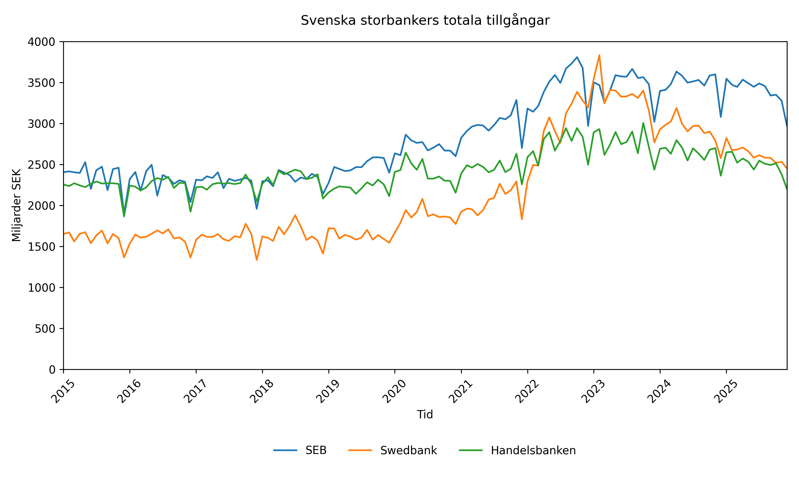
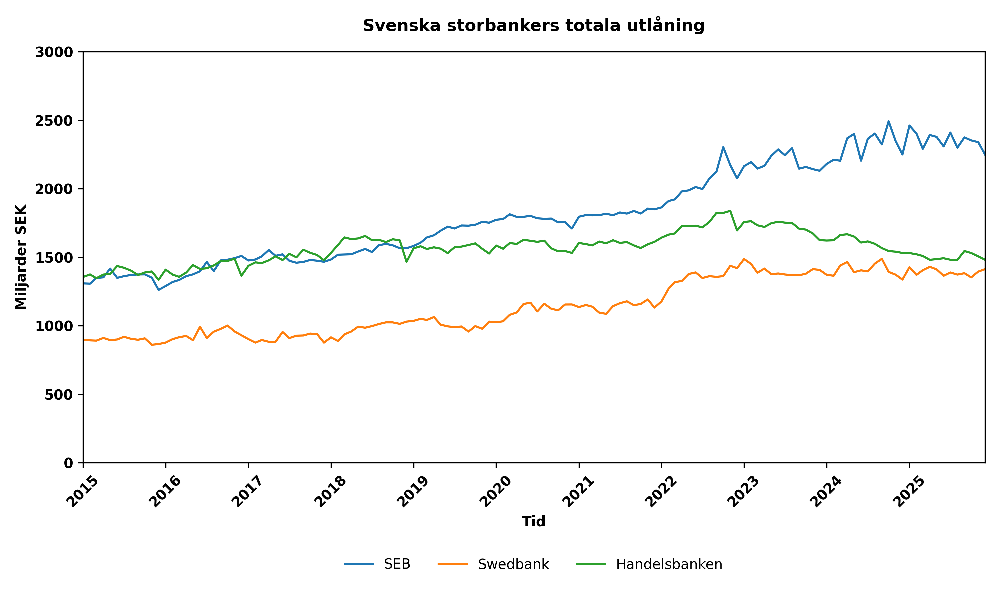
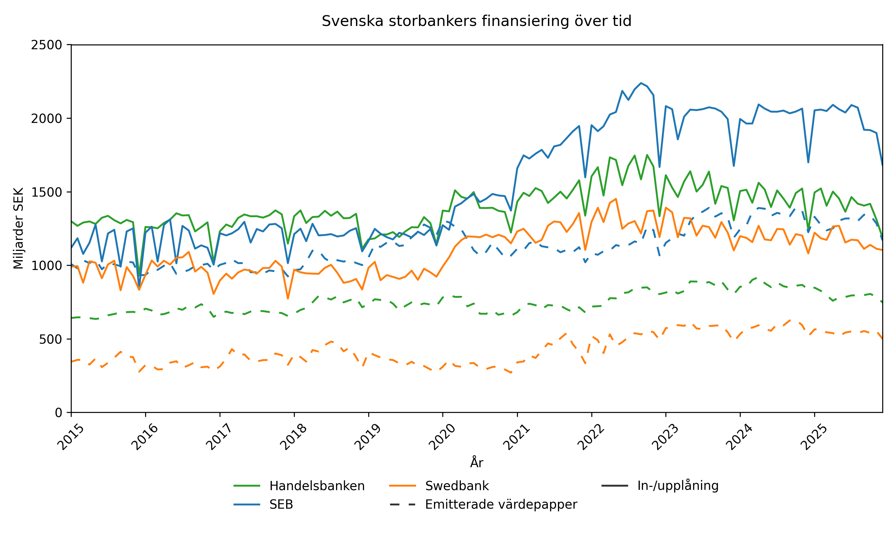
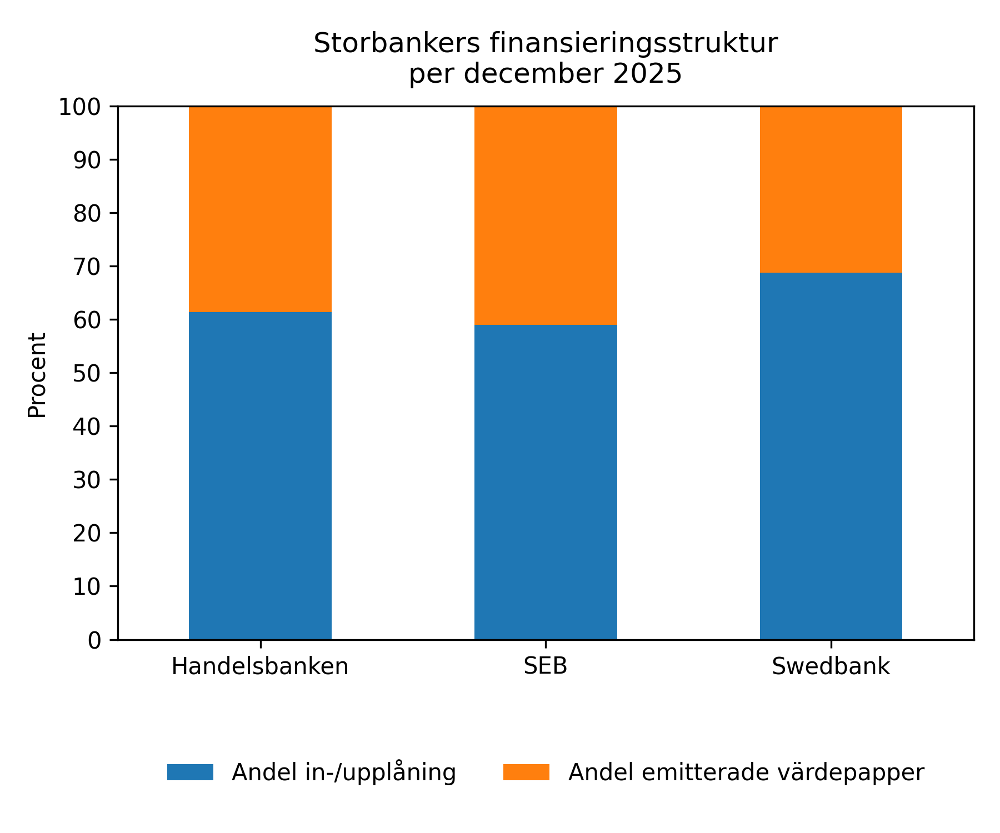
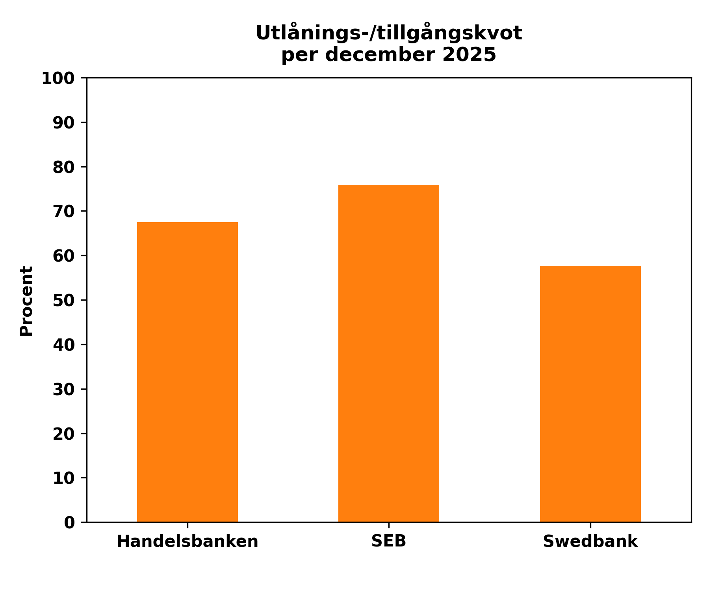
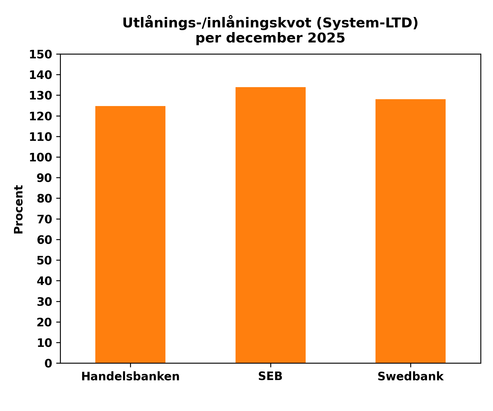

# Structural Analysis of Swedish Bank Balance Sheets (2015–2025)

## Overview
This repository provides a structural, policy-inspired analysis of the balance sheets of the three major systemically important Swedish banks: **SEB**, **Swedbank**, and **Handelsbanken** over the period 2015–2025. 

The analysis is based on official monthly financial market statistics from Statistics Sweden (SCB). It examines the macro-financial evolution of the banks' total assets, lending dynamics, and wholesale vs. retail funding mix across different interest rate cycles.

---

## Data
The dataset is sourced from **Statistics Sweden (SCB)** financial market statistics for Monetary Financial Institutions (MFI). 

It contains high-frequency monthly balance sheet data including the following key positions:
* **Total assets** (Post 120)
* **Total lending to the public** (Post 103)
* **Deposits and general funding** (Post 201 - *In-/upplåning, Totalt*)
* **Issued securities** (Post 203 & 2035 - *including covered bonds / bostadsobligationer*)

The sample isolates the three core Swedish commercial banks, exluding peripheral MFIs to maintain analytical focus on systemically important institutions.

---

## Methodology
The analytical pipeline is built using a clean separation of concerns in Python:
1. **Data Cleaning (`data_cleaning.py`)**: Handles the raw SCB `.csv` matrices, maps legal names to standard identifiers, reshapes the tables from wide to long format using Pandas `.melt()`, and synchronizes dates into true datetime stamps.
2. **Analysis (`analysis.py`)**: Computes Compound Annual Growth Rates (CAGR) across sub-periods (2015–2025 vs. 2020–2025) and derives system-wide structural indicators.
3. **Visualization (`plotting.py`)**: Generates and exports publication-grade charts to the `/figures` directory.

### Core Metrics Covered:
* **Asset & Lending CAGR**: Dissecting growth speeds before and after the 2022 macroeconomic regime shift.
* **Funding Decomposition**: Evaluating the ratio between deposits/general funding and capital market financing.
* **Loan-to-Asset (LTA) Ratio**: Determining credit risk concentration within total assets.
* **System Loan-to-Deposit (LTD) Ratio**: Defined as Total Lending and Deposits \ General Funding.

* *Note: In line with SCB MFI definitions, the denominator includes interbank and institutional funding, serving as a broad measure of structural market dependency rather than pure retail deposits.*

---

## Key Findings & Visualizations

### 1. Asset & Lending Growth (2015–2025)
Total assets and lending grew at a stable average annual rate (CAGR) of approximately 4% over the 10-year period. A significant acceleration phase is visible between 2020 and 2023, driven by rapid credit expansion (primarily residential mortgages) in a prolonged low-interest-rate environment. Post-2022, monetary tightening and rate hikes by the Riksbank led to a visible deceleration in credit dynamics and a normalization of balance sheet expansion.




### 2. Funding Structure & Market Dependency
The funding side shows a consistent reliance on the classic Swedish banking model. General deposits and interbank funding (In-/upplåning) constitute roughly 63% of total funding, while issued securities (predominantly covered bonds used for mortgage backing) make up 37%. Over the latter half of the decade, a gradual structural shift can be observed where wholesale market funding increased in relative growth speed.




### 3. Structural Ratios & Vulnerabilities (December 2025)
At the end of 2025, lending constituted around 67% of the major banks' total assets, confirming credit provision as the core business driver. The system-wide Loan-to-Deposit (LTD) ratio reached approximately 129%, meaning that customer and institutional lending significantly outstripped stable deposit funding. 

The remaining gap is systematically bridged via international and domestic capital markets. This highlights the banking sector's deep structural dependency on well-functioning covered bond markets—a key focal point for financial stability assessments by authorities such as FI and the Riksbank.




---

## How to Run the Project

1. **Clone the repository**:
   ```bash
   git clone [https://github.com/your-username/swedish-banking-sector-analysis.git](https://github.com/your-username/swedish-banking-sector-analysis.git)
   cd swedish-banking-sector-analysis
   ```

Install dependencies:

```Bash
pip install -r requirements.txt
Execute the scripts in order:

Bash
python src/data_cleaning.py
python src/analysis.py
python src/plotting.py
```

## Limitations

The analysis is strictly descriptive and does not imply causal macro-econometric relationships.

Ratios are simplified aggregations of complex consolidated bank balance sheets.

SCB's broad definition of In-/upplåning combines domestic household deposits with corporate and financial counterparty liabilities, which prevents a isolated breakdown of pure retail deposit sticky-floats.

Repository Structure
Plaintext
├── data/              # Raw SCB input and intermediate processed .csv files
├── figures/           # Output directory for generated high-resolution plots
├── report/            # LaTeX source code and the compiled formal PDF report
├── src/               # Modularized Python source code
│   ├── data_cleaning.py
│   ├── analysis.py
│   └── plotting.py
├── requirements.txt   # Pinpointed python dependencies for reproducibility
└── README.md          # Project summary and documentation

## Tools Used

- Python (Pandas, NumPy, Matplotlib, Seaborn)
- LaTeX (Formal typesetting of the final report)
- Statistics Sweden (SCB) Financial Market Statistics database

## Author
Tobias Bengtsson 
